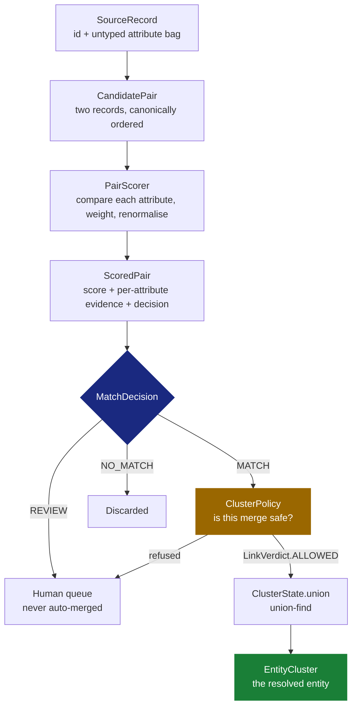

# Coalesce — code walkthrough

Every file in the repository, what it does, and why it is written the way it is.

This is the third of three documents, and they do different jobs:

| Document | Answers |
| :--- | :--- |
| `README.md` | What is this project and why does it exist |
| `INTERVIEW.md` | What do I say about it out loud |
| **`CODE_WALKTHROUGH.md`** | **What does each line actually do** |

Everything below was checked against the source, and every number comes from a run recorded in
§13. Where the code has a defect or a gap, it is written down here rather than left to be found.

---

## Contents

1. [How to read this repository](#1-how-to-read-this-repository)
2. [The mental model in one page](#2-the-mental-model-in-one-page)
3. [Package map](#3-package-map)
4. [The data layer](#4-the-data-layer)
5. [The comparison layer](#5-the-comparison-layer)
6. [The scoring layer](#6-the-scoring-layer)
7. [The clustering layer](#7-the-clustering-layer)
8. [The provenance layer](#8-the-provenance-layer)
9. [The ports](#9-the-ports)
10. [The evaluation harness](#10-the-evaluation-harness)
11. [Spring wiring](#11-spring-wiring)
12. [The Apex port](#12-the-apex-port)
13. [What a live run prints](#13-what-a-live-run-prints)
14. [Known defects and gaps](#14-known-defects-and-gaps)

---

## 1. How to read this repository

There are about 3,000 lines of Java and 1,400 of Apex. You do not need to read them in file order,
and doing so is the slowest possible route. Read these eight files and you will understand
everything else by inference:

1. **`AttributeComparator`** — the contract every similarity measure obeys. Four clauses, and each
   one exists because breaking it causes a specific bug.
2. **`JaroWinklerComparator`** — one comparator in full, so the contract stops being abstract.
3. **`ResolutionSchema`** — the configuration object that makes the engine schema-agnostic.
4. **`PairScorer`** — where two records become a number and a decision. The single most important
   file in the project.
5. **`UnionFind`** — how edges become clusters.
6. **`ClusterPolicy`** — why edges are not allowed to become clusters unsupervised.
7. **`LinkLedger`** — how a merge is undone.
8. **`ResolutionDemo`** — the wiring that runs all of the above.

**A note before you start.** The Javadoc in this codebase is unusually heavy. That is deliberate:
the comments record *why* a decision was made, because the what is readable from the code. If you
are skimming, read the class-level Javadoc and skip the method bodies — the class comments carry the
reasoning.

---

## 2. The mental model in one page

Entity resolution answers one question: **do these two records describe the same real-world thing?**

The engine answers it in five stages. Every stage is a separate package, and each one hands a
value object to the next.



Two ideas explain most of the design.

**A missing value is not a disagreement.** If one record has no phone number, that is not evidence
the two people are different — it is the absence of evidence. Comparators return *empty* rather than
zero, and the scorer divides only by the weight of the attributes both records actually had. This
one rule shapes `AttributeComparator`, `PairScorer`, `ScoredPair` and every comparator.

**Similarity is not transitive.** Jon ≈ John ≈ Smyth ≈ Joan is four believable steps between two
strangers. Union-find will happily merge all four. `ClusterPolicy` exists solely to stop it.

---

## 3. Package map

```
com.coalesce
├── CoalesceApplication          Spring Boot entry point (9 lines, does nothing else)
├── config/
│   └── MatchingConfiguration    Wires comparators into a registry. The only Spring file.
├── domain/                      ← zero framework imports, by rule
│   ├── model/                   What a record is
│   ├── match/                   Comparing two records
│   │   └── comparator/          The seven similarity algorithms
│   ├── schema/                  Matching configuration
│   ├── cluster/                 Turning matches into entities
│   ├── link/                    Provenance and reversibility
│   ├── port/                    Persistence interfaces (no adapters exist)
│   └── error/                   Three exception types
└── eval/                        Fixture loading, metrics, console runner
```

`domain` importing no framework is the rule that pays for itself in §12: because the matching logic
had no Spring in it, it could be ported to Apex, which cannot run a JVM at all.

---

## 4. The data layer

### `model/RecordId.java` — who a record is

A record's identity is a `(source, local)` pair, not a bare string.

```java
public record RecordId(String source, String local) {
```

**Why the source is part of the identity.** Two systems will both use `"1001"`. A bare string id
silently merges an unrelated hospital patient with an unrelated bank customer the first time a second
source is onboarded.

The constructor rejects a source containing `:`, which looks fussy until you see why:

```java
if (source.indexOf(':') >= 0) {
    throw new IllegalArgumentException("source must not contain ':' ...");
}
```

`qualified()` renders the id as `source:local` and that string is the database key. Without the
constraint, source `"a:b"` + local `"c"` and source `"a"` + local `"b:c"` both render as `"a:b:c"` —
two unrelated records colliding on one key, with no trace of why. Escaping would also work;
forbidding the character is cheaper, and source names are chosen by operators rather than arriving
from source systems.

### `model/SourceRecord.java` — what a record holds

```java
public record SourceRecord(RecordId id, Map<String, String> attributes)
```

**Why every attribute is a `String`.** The engine must accept patient records, supplier catalogues
and bank customers without recompiling, so it cannot have typed fields. Typing lives in the schema's
comparator assignment instead: `"1985-03-02"` is a date to `DateComparator` and an opaque string to
`ExactComparator`. The cost is that malformed input surfaces at comparison time rather than at
ingest — which is exactly why the comparator contract requires comparators never to throw.

The compact constructor does one important thing:

```java
attributes = attributes.entrySet().stream()
        .filter(entry -> entry.getValue() != null && !entry.getValue().isBlank())
        .collect(Collectors.toUnmodifiableMap(Map.Entry::getKey, entry -> entry.getValue().trim()));
```

Null and blank normalise to **absent**. An empty string in a CSV cell becomes "not on file" rather
than a value comparators would try to match. This is the first place the missing-is-not-different
rule is enforced.

`Record` was avoided as a name because `java.lang.Record` exists and every file touching both would
read badly.

---

## 5. The comparison layer

### `match/AttributeComparator.java` — the contract

Thirty-seven lines, most of them Javadoc, and the whole engine's correctness rests on them.

```java
public interface AttributeComparator {
    String id();
    OptionalDouble compare(String left, String right);
}
```

Four clauses, each load-bearing:

| Clause | What breaks without it |
| :--- | :--- |
| **Returns `[0,1]`, not a boolean** | "Jon" vs "John" is neither match nor mismatch. A boolean throws away the only information the scorer can weigh. |
| **Returns empty when absent, not zero** | Scoring a missing value 0.0 penalises sparse records — the ones most in need of matching. |
| **Must be total** | Untrusted text. A date comparator handed `"unknown"` must return empty, not throw, or one malformed cell kills a batch of millions. |
| **Must be symmetric** | Clustering assumes an undirected graph. Asymmetry makes clusters depend on insertion order, which is near-impossible to debug afterwards. |

`OptionalDouble` rather than `Double` is what makes "no opinion" expressible without a null.

### `match/comparator/` — the seven algorithms

| Comparator | id | Returns | Use for |
| :--- | :--- | :--- | :--- |
| `JaroWinklerComparator` | `jaro-winkler` | graded | personal names |
| `LevenshteinComparator` | `levenshtein` | graded | codes, SKUs, identifiers |
| `SoundexComparator` | `soundex` | 1.0 / 0.0 | names heard rather than read |
| `TokenCosineComparator` | `token-cosine` | graded | addresses, company names |
| `ExactComparator` | `exact` | 1.0 / 0.0 | emails, postcodes, national ids |
| `NumericComparator` | `numeric` | graded | amounts, quantities |
| `DateComparator` | `date` | graded | dates of birth |

#### `JaroWinklerComparator` — the default for names

Two properties matter for hand-typed names. It charges **half a transposition** for an adjacent-letter
swap where Levenshtein charges two edits ("Micheal"/"Michael"), and it **boosts a shared prefix**,
because people mistype the ends of names far more than the beginnings.

`jaro()` runs in three phases:

```java
int window = Math.max(0, Math.max(lenA, lenB) / 2 - 1);
```

**Phase 1, the matching window.** A character in `a` may only match one in `b` within this distance
of its own index. This is what stops `"abcdef"` and `"fedcba"` scoring as a perfect anagram match.

```java
for (int i = 0; i < lenA; i++) {
    int from = Math.max(0, i - window);
    int to = Math.min(lenB, i + window + 1);
    ...
    matchedA[i] = true; matchedB[j] = true; matches++; break;
}
```

**Phase 2, transpositions.** Walk the matched characters of both strings in parallel; every position
where they disagree is *half* a transposition, since a swap shows up twice.

```java
double t = transpositions / 2.0;
return ((m / lenA) + (m / lenB) + ((m - t) / m)) / 3.0;
```

**Phase 3, the Winkler prefix bonus** — applied only above `BOOST_THRESHOLD = 0.7`:

```java
if (jaro < BOOST_THRESHOLD) return jaro;
return Math.min(1.0, jaro + prefix * PREFIX_SCALE * (1.0 - jaro));
```

The gate matters. Without it, unrelated names sharing an initial ("Smith"/"Sanchez") get lifted
toward the match threshold — the wrong direction to be wrong in. `4 × 0.1` caps the bonus so the
result cannot exceed 1.

`JaroWinklerComparatorTest` pins this implementation to the literature rather than to itself,
asserting the published values from Winkler's papers at both stages — MARTHA/MARHTA `jaro` 0.9444
and `similarity` 0.9611, DIXON/DICKSONX 0.7667 and 0.8133. Checking the un-boosted Jaro value
separately is what would localise a regression to the prefix bonus rather than the core metric. The
Apex port asserts the same pairs plus DWAYNE/DUANE 0.840 (see §12).

**Where it is wrong:** long strings. `"17 Oak Street"` vs `"Oak Street 17"` scores poorly because
almost every character moved. It also cannot know "Bill" is "William" — no character-level metric
can, that needs a nickname table, which does not exist here.

#### `LevenshteinComparator`

Edit distance normalised by the longer string's length, which is what makes it comparable across
attributes — a raw distance of 2 is near-identity for a 40-character address and near-nonsense for a
3-letter code.

Two rows rather than a full DP table:

```java
int[] previous = new int[width];
int[] current = new int[width];
```

O(min(n,m)) space instead of O(n·m). At hundreds of millions of comparisons per batch, that is the
difference between fitting in cache and not. It iterates the longer string and indexes rows by the
shorter, keeping both retained rows as small as possible.

**Prefer it over Jaro-Winkler for machine-generated identifiers**, where there is no reason to
believe errors cluster at the end, so the prefix bonus would be an unjustified thumb on the scale.

#### `SoundexComparator`

Catches the error class no character-level metric reliably catches: a name transcribed by ear.
"Robert" and "Rupert" score around 0.80 under Jaro-Winkler because the vowels and a consonant
differ; Soundex assigns both `R163` and calls it a match.

The output is **deliberately near-binary** — 1.0 or 0.0. There is no meaningful sense in which two
Soundex codes are 60% alike, and inventing one would dress up a coarse signal as a precise one.

The encoder has two subtleties most implementations get wrong:

```java
case 'H', 'W' -> TRANSPARENT;   // neither encodes nor breaks a run
default       -> VOWEL;          // breaks a run of same-coded consonants
```

H and W are *transparent*: skipped without disturbing `previous`, so "Ashcraft" treats the S and C
either side of the H as adjacent and collapses them. Vowels are *not* transparent — they break runs,
which is why "Tymczak" keeps both its Zs distinct.

`SoundexComparatorTest` pins both edge cases and the motivating example:

```java
assertThat(SoundexComparator.encode("Ashcraft")).isEqualTo("A261");   // H transparent
assertThat(SoundexComparator.encode("Tymczak")).isEqualTo("T522");    // vowel breaks the run
assertThat(SoundexComparator.encode("Robert")).isEqualTo("R163");
assertThat(SoundexComparator.encode("Rupert")).isEqualTo("R163");     // same code
assertThat(JaroWinklerComparator.similarity("robert", "rupert")).isLessThan(0.85);
```

That last line is the point of the whole class: it asserts that the comparator Soundex is
*complementing* fails on this pair, so the test would catch someone deciding Soundex is redundant.

**Honest limitations, stated in the source.** It is from 1918, models English consonant phonology,
and degrades badly on South Asian, Chinese and Slavic names — a real fairness problem in a system
deciding whether two people are the same person. Its sharpest flaw is keeping the first letter
verbatim, so "Karl"/"Carl" and "Catherine"/"Katherine" both score 0. Those are precisely the pairs
Jaro-Winkler also handles badly, so for that error class **the two comparators fail together rather
than covering for each other.** Double Metaphone is the right upgrade and is not implemented.

#### `TokenCosineComparator`

Cosine similarity over token-frequency vectors. Order-insensitive by construction, so
`"17 Oak Street, Apt 3"` and `"Apt 3, Oak Street 17"` are near-identical, which is the correct
answer — they are the same address.

Three details worth noting:

```java
if (a.equals(b)) return OptionalDouble.of(1.0);
```

Identical bags short-circuit to exactly 1.0 rather than arriving at `0.9999999999999998` through two
square roots, which would fail a threshold set at 1.0.

```java
Map<String, Integer> smaller = a.size() <= b.size() ? a : b;
```

Walk the smaller vector — tokens absent from the other contribute nothing to the dot product.

**The known weakness: no IDF.** Agreement on "Street" counts as much as agreement on "Kowalczyk",
which is plainly wrong. Fixing it needs corpus-wide document frequencies, which would mean injecting
a statistics snapshot and this comparator ceasing to be a pure function of its two arguments — a
design change rather than a tweak. Schemas mitigate it by pairing this with a high-signal exact
attribute such as postcode.

#### `ExactComparator`

Normalises case and strips non-alphanumerics, then compares for equality.

```java
return value.toLowerCase(Locale.ROOT).replaceAll("[^a-z0-9]", "");
```

`"AB-12 34 CD"` and `"ab123 4cd"` are the same value formatted differently. **Two emails differing
by one character are two different mailboxes**, and scoring them 0.95 would be a category error —
a strong-looking partial match on a supposedly unique key could drag an incorrect pair over the
threshold.

#### `NumericComparator`

Similarity decays with the **relative** gap, dividing by the larger magnitude:

```java
double scale = Math.max(Math.abs(x), Math.abs(y));
return OptionalDouble.of(Math.max(0.0, 1.0 - (Math.abs(x - y) / scale)));
```

Relative rather than absolute because the engine does not know what it is comparing — £5 is nothing
on a salary and everything on a unit price, so any fixed tolerance is right for exactly one
attribute. Unparseable input yields empty; real data has `"n/a"` and `"~500"` in numeric columns,
and treating those as disagreement would manufacture evidence out of a data-quality problem.

#### `DateComparator`

The only comparator with a hand-coded special case, and it earns it:

```java
private static boolean isDayMonthTransposition(LocalDate first, LocalDate second) {
    return first.getYear() == second.getYear()
            && first.getDayOfMonth() == second.getMonthValue()
            && first.getMonthValue() == second.getDayOfMonth();
}
```

`1985-03-02` and `1985-02-03` are 27 days apart arithmetically, which a decay curve scores as a
near-mismatch. In practice they are overwhelmingly one date read as American by one system and
British by another — the single most common defect in cross-border date data. Scored **0.9 rather
than 1.0**, because the pair genuinely might be two different dates and the scorer should see the
residual doubt.

Otherwise similarity falls linearly to zero over `DECAY_DAYS = 730`. Two years is a deliberate
choice: a few days apart is usually a typo worth partial credit, while a decade apart is a different
person — and an over-generous curve there **merges parents with children who share a name and
address**, a real failure mode in patient matching.

Formats are probed in order, ISO first. Ambiguous input like `02/03/1985` is parsed day-first, which
is a guess — and the transposition allowance above is what stops the guess being harmful, since both
readings score 0.9 against each other anyway.

### `match/ComparatorRegistry.java`

Resolves the comparator id in a schema (`"surname" -> "jaro-winkler"`) to an implementation. This
indirection is what makes a schema **data rather than code**, so onboarding a new domain is a
configuration change.

```java
AttributeComparator clash = resolved.putIfAbsent(comparator.id(), comparator);
if (clash != null) {
    throw new IllegalStateException("duplicate comparator id '%s': %s and %s"...);
}
```

Duplicate ids fail at construction. Two comparators silently competing for `"exact"` would make a
schema's semantics depend on classpath ordering, and the resulting wrong-but-plausible match rates
would be very hard to trace.

`require()` throws with the list of registered ids rather than returning null, so a typo in a schema
names itself.

### `match/AttributeComparatorSpec.java`

One attribute's participation: `(attribute, comparator, weight, blocking)`.

Weights need not sum to 1 — the scorer renormalises. Zero and negative weights are rejected, because
"this attribute cannot influence the decision" is better expressed by leaving it out of the schema
than by a number that quietly disables a rule someone thought they had configured.

The `blocking` flag marks attributes suitable for candidate generation. Marking a high-cardinality
one (surname, postcode) keeps candidate generation sub-quadratic; marking a low-cardinality one
(country, gender) produces blocks so large that blocking saves nothing.

### `match/CandidatePair.java`

An unordered pair, canonicalised at construction:

```java
if (compare(left, right) > 0) { RecordId lower = right; right = left; left = lower; }
```

**Not cosmetic.** Several blocking strategies get unioned and each discovers pairs in its own order.
Without a canonical form the composite would score most pairs twice, overstate the candidate count
the reduction ratio is computed from, and store two links for one pair — where a later un-merge
would retract only one and leave the cluster silently intact.

Ordering is by the `(source, local)` tuple, **not hash code**, so pair identity is stable across JVM
runs. Hash ordering would be reproducible within a process and different after a restart, which is
the worst version of this bug: a stored link would stop matching a freshly computed one.

Self-pairs throw rather than returning 1.0, so a blocking strategy that emits the diagonal fails
loudly instead of inflating precision.

---

## 6. The scoring layer

### `schema/ResolutionSchema.java`

The object that makes the engine schema-agnostic. Onboarding a new entity type is authoring one of
these, not writing code.

**Everything is validated at construction**, because a schema is the one place where a
plausible-looking mistake produces wrong answers rather than a crash:

| Check | Failure it prevents |
| :--- | :--- |
| duplicate attribute | one field silently double-weighted |
| `reviewThreshold > matchThreshold` | a review band that swallows every match |
| no blocking attribute | candidate generation degrades to O(n²) — fine in a 500-record test, fatal at a million |
| `minContributingAttributes > attributes.size()` | MATCH becomes unreachable and the whole dataset routes to review, which looks like a quality problem rather than the config error it is |

**Version is part of the schema, not metadata about it.** Every link records the version that
produced it. Without that, a threshold change makes the existing link set unexplainable — a steward
asking "why is this merged" gets it scored against today's rules and sees a score below today's
threshold.

The builder exists because the record has **seven positional arguments, two of which are unrelated
thresholds in `[0,1]` and two more are guard settings**. That is exactly the shape that lets an
author transpose two numbers and get a working-but-wrong schema:

```java
ResolutionSchema.named("patient")
    .compare("full_name", "jaro-winkler", 3.0)
    .blockOn("postcode", "exact", 1.5)
    .thresholds(0.70, 0.87)     // review, match — named at the call site
    .evidenceGuard(2, 0.35)
    .build();
```

### `match/PairScorer.java` — the most important file

Turns two records and a schema into a score and a decision. The whole method is one loop and one
division.

**Step 1 — accumulate over comparable attributes only:**

```java
for (AttributeComparatorSpec spec : schema.attributes()) {
    Optional<String> a = left.attribute(spec.attribute());
    Optional<String> b = right.attribute(spec.attribute());
    if (a.isEmpty() || b.isEmpty()) { absent.add(spec.attribute()); continue; }

    OptionalDouble similarity = comparators.require(spec.comparator()).compare(a.get(), b.get());
    if (similarity.isEmpty()) { absent.add(spec.attribute()); continue; }
    ...
    weightedSum  += spec.weight() * value;
    presentWeight += spec.weight();
}
```

Note that **"absent" and "present but uninterpretable" are treated identically** — `"n/a"` in a date
column is indistinguishable from missing as far as evidence goes.

The contract is enforced rather than trusted:

```java
if (!Double.isFinite(value) || value < 0.0 || value > 1.0) {
    throw new IllegalStateException("comparator '%s' returned %s ... outside [0,1]");
}
```

A comparator that breaks `[0,1]` would skew every score it touches, so it is named loudly instead of
distorting the run quietly.

**Step 2 — renormalise. This is the whole point:**

```java
double score = clampToUnit(weightedSum / presentWeight);
```

Dividing by `presentWeight`, not `schema.totalWeight()`. The alternative — scoring absent as 0.0 and
dividing by the full weight — is the standard mistake, and it does not add noise uniformly. It
penalises precisely the sparse records, which are disproportionately the ones that need matching,
because a record with half its fields empty is usually the one that got typed in twice. A pair
agreeing perfectly on name, date of birth and national id would score 0.6 for lacking an address.

**Step 3 — the failure mode renormalisation creates.** Because the denominator shrinks with the
evidence, confidence stops being tied to how much was known. **Two records sharing only
`country="US"` score 1.0** — a perfect, meaningless match. In real data this is not a corner case:
sparse records cluster together, and unguarded renormalisation merges them into one giant component
of "records we know nothing about".

Two guards close it, and the second is not redundant:

```java
boolean enoughEvidence = contributing >= schema.minContributingAttributes()
        && evidenceShare >= schema.minEvidenceWeightShare();
return enoughEvidence ? MatchDecision.MATCH : MatchDecision.REVIEW;
```

A count alone treats three weak attributes as stronger than one decisive one, inverting what the
weights say — hence the weight-share floor as well.

**A pair that clears the threshold but fails a guard is demoted to `REVIEW`, not `NO_MATCH`.** It
looks like a match on the evidence available; what is missing is evidence, and a human with access to
more of it is the right resolution. Demoting to `NO_MATCH` would treat absence as disagreement — the
same error, one layer up. §13 has a live example of exactly this firing.

**The unscoreable case:**

```java
if (presentWeight == 0.0) {
    return new ScoredPair(pair, 0.0, contributions, absent, 0.0, MatchDecision.NO_MATCH);
}
```

Reported as `NO_MATCH` because the engine must not merge it, but the empty breakdown is what tells a
reviewer nothing was actually compared.

**Stated limitation.** The model is a linear weighted mean: hand-set, independent, additive.
Fellegi-Sunter learns per-attribute agreement/disagreement likelihoods and sums log-likelihood
ratios, which is better calibrated and can say that agreement on a rare surname is worth more than on
a common one. It needs labelled data or EM over the candidate set. **Attribute interactions are not
modelled at all** — agreeing on both first and last name is treated as exactly the sum of its parts.

### `match/ScoredPair.java`

The result, carrying its own evidence:

```java
public record ScoredPair(CandidatePair pair, double score, Map<String, Double> attributeScores,
        Set<String> absentAttributes, double evidenceWeightShare, MatchDecision decision)
```

**Why the breakdown is part of the value, not a debug log.** The question a steward asks is never
"what was the score" but "why". A bare double cannot answer it, and reconstructing the answer later
means re-running against a schema version that may have moved on. A reviewer sees
`surname 0.94, dob 1.0, address absent` rather than `0.83`.

`absentAttributes()` is deliberately as prominent as the scores: it is the difference between "these
two disagree on address" and "neither record has an address" — opposite conclusions one number
cannot distinguish.

> **Defect.** The constructor sorts into a `TreeMap`/`TreeSet` and then calls `Map.copyOf` /
> `Set.copyOf`, which return implementations with **unspecified iteration order** — so the sorting is
> discarded and `explain()` output is not reproducible. This is visible in the live run in §13. The
> Apex port hit the same problem and solved it correctly with a sorted `List`; see §12.

### `match/MatchDecision.java`

Three outcomes, not two.

A binary decision must place one cut point on the score distribution, and the region around it is
exactly where the classifier has no information. Every borderline pair is therefore forced to be
wrong in one of two directions, and **the two errors are not symmetric in cost**: a false merge in
KYC screening can clear a sanctioned party by attaching them to a clean identity; in patient matching
it can attach one person's allergies to another's chart.

```java
public boolean autoMergeable() { return this == MATCH; }
```

One place decides what may auto-merge, so a future `MATCH_STRONG` tier does not require finding every
`== MATCH` comparison in the codebase.

**The cost is stated rather than hidden:** the review band is unbounded operational work. A band wide
enough to catch every ambiguous pair can queue more than a team can clear, at which point the queue
is a backlog rather than a control. That is why both thresholds are schema configuration.

---

## 7. The clustering layer

### `cluster/UnionFind.java`

Matching produces edges; resolution needs connected components. Union-find gives near-constant
amortised cost, O(α(n)), where α is under 5 for any input that fits in the universe.

Two optimisations, and **both are needed**:

```java
private int root(int index) {
    while (parent[index] != index) {
        parent[index] = parent[parent[index]];   // path halving
        index = parent[index];
    }
    return index;
}
```

**Path halving** points each node at its grandparent while traversing, flattening the tree as a side
effect of reading it. Chosen over full two-pass compression because it flattens nearly as well in one
pass with no recursion — and `find` is called far more often than `union`.

```java
if (rank[a] < rank[b]) { int swap = a; a = b; b = swap; }
parent[b] = a;
size[a] += size[b];
if (rank[a] == rank[b]) { rank[a]++; }
```

**Union by rank** attaches the shallower tree beneath the deeper one, so an adversarial merge order
cannot degenerate the forest into a linked list. Either optimisation alone gives O(log n); together
they give the inverse-Ackermann bound.

`union` returns a boolean — true if a merge happened, false if already connected. The caller needs
that distinction: counting redundant links as merges would overstate how much work a run did.

Elements are mapped to integer slots (`Map<T,Integer>` + `List<T>`) so the hot arrays are primitive
`int[]` rather than boxed objects.

**The trap this class deliberately does not solve:** it does *only* transitive closure. If A matches
B and B matches C, A and C land in one cluster even when they are obviously different people.
Guarding that is policy, and policy lives outside the graph algorithm — which is what keeps both
testable alone.

### `cluster/ClusterState.java`

`UnionFind` plus the one thing a policy needs that union-find deliberately does not provide:
**cheap cluster membership**. `UnionFind.clusters()` is O(n) per call, so calling it per candidate
link makes a run quadratic in records — the exact cost blocking exists to avoid.

```java
List<RecordId> larger  = listA.size() >= listB.size() ? listA : listB;
List<RecordId> smaller = larger == listA ? listB : listA;
larger.addAll(smaller);
```

**Weighted merge, not a micro-optimisation.** Smaller-into-larger means any element is copied at most
log n times, total O(n log n). Always appending B to A is O(n) per merge and quadratic overall, and it
degrades in exactly the case that matters: one large cluster absorbing records one at a time, which
is what a real run looks like.

A subtlety worth understanding: union-find picks a root **by rank**, this picks a list **by size**,
so they can disagree about which side won. The merged list is re-keyed to whichever root union-find
chose:

```java
membersByRoot.put(sets.find(a), larger);
```

> **Defect.** `clusterSize()`, `members()` and `representative()` each call `add()` first, so these
> query methods mutate state — meaning `ClusterPolicy.evaluate` mutates the `ClusterState` it
> documents itself as leaving alone. It is currently harmless because `ResolutionRun` pre-seeds every
> record, so `add()` is always a no-op. It is still a contract violation waiting for a caller that
> does not pre-seed.

### `cluster/ClusterPolicy.java` — the file that justifies the project

Transitive closure is not a correct resolution policy. Run it over real data and the failure is not a
few bad merges, it is **a phase transition**: once enough weak links exist, one component swallows a
large fraction of the data, and because every merge was individually plausible, nothing in the logs
looks wrong.

Thresholding harder does not fix it — raising the match threshold until no chain forms also discards
the genuinely borderline true matches, trading a catastrophic precision failure for a large recall
failure. The chain has to be broken with a property pair scores cannot see: **what the resulting
cluster looks like**.

`evaluate()` runs its checks cheapest-and-most-decisive first:

```java
1. scored.decision() != MATCH        → REVIEW_REQUIRED / NOT_A_MATCH
2. state.connected(left, right)      → ALREADY_CONNECTED   (redundant, not a refusal)
3. findSeparation(...)               → MANUALLY_SEPARATED  (a human said no)
4. mergedSize > maxClusterSize       → MAX_CLUSTER_SIZE
5. sampleCohesion(...)               → INSUFFICIENT_COHESION
```

Only step 5 costs comparisons.

**Cohesion is the real defence.** Before merging A and B, sample pairs across the boundary and require
their mean similarity to clear a threshold. In an A~B~C~D chain, merging `{A,B,C}` with `{D}` forces
(A,D) and (B,D) to be scored — the comparisons transitive closure never makes — and their low scores
refuse the merge. It is a local approximation of a correlation-clustering objective, which is NP-hard
to optimise globally.

**Maximum cluster size is a blunt circuit breaker for what cohesion misses**, because cohesion is
sampled and can be defeated by a dense blob of near-identical junk: a source emitting thousands of
`"TEST TEST"` rows forms a genuinely cohesive cluster that is nonetheless wrong. Having both is an
admission that the statistical guard is not sufficient.

The sampling loop:

```java
long total  = (long) leftCluster.size() * rightCluster.size();
int  width  = rightCluster.size();
long stride = Math.max(1L, total / config.cohesionSampleSize());

for (long index = 0; index < total && sampled < config.cohesionSampleSize(); index += stride) {
    RecordId a = leftCluster.get((int) (index / width));
    RecordId b = rightCluster.get((int) (index % width));
    if (a.equals(pair.left()) && b.equals(pair.right()) || ...) continue;   // exclude the link itself
    ...
}
```

Three deliberate choices:

**Sampling rather than exhaustive.** Checking every cross pair is |A|×|B|; merging into a 500-member
cluster one record at a time costs 500 comparisons for that link alone, quadratic across a run — the
cost blocking exists to eliminate, reintroduced at the clustering stage. The trade-off is stated: the
sampled mean has standard error roughly s/√k, so a merge exhaustive checking would refuse can pass.

**Deterministic stride rather than random.** When a steward asks why two records did not merge, the
answer must be the same today as in the batch that produced it. Random sampling would make refusals
unreproducible unless the seed were persisted per decision. The cost is a known bias — striding can
correlate with merge order, so it is not a uniform random sample. Reservoir sampling with a persisted
seed is the proper fix and is not implemented.

**The candidate link is excluded from its own sample.** Including it would let a merge corroborate
itself: for two singletons the link is the *only* cross pair, so cohesion would equal the pair score,
which already cleared a higher threshold — the check would always pass and measure nothing.

That exclusion has a consequence worth knowing before an interviewer finds it:

```java
if (cohesion.sampled() == 0) {
    return LinkVerdict.allow(pair, "no corroborating cross-cluster pair was scoreable", ...);
}
```

**Cohesion structurally cannot fire when both sides are singletons**, because after excluding the
link there is nothing left to sample. It only becomes active once one side has 2+ members, which
means *link application order* governs whether the guard engages at all. This is correct behaviour —
refusing on zero samples would invent disagreement out of missing data — but it means the guard is
weaker than it first appears.

Two interfaces keep this class free of the matching stack:

```java
public interface ScoreOracle { OptionalDouble score(RecordId left, RecordId right); }
public interface Separations { Set<RecordId> separatedFrom(RecordId id); }
```

`ScoreOracle` exists because cohesion needs scores for pairs blocking never proposed — that is the
entire point. Depending on an interface rather than the scorer means chain tests can drive the policy
with a hand-written score table and no comparators at all. `Separations` is indexed **by record**
rather than exposed as a pair predicate so the cross-boundary check costs O(|smaller| + matches)
instead of O(|A|×|B|) predicate calls.

`Config.defaults()` is `(50, 0.60, 12)` — chosen for person-level resolution, where a person is
rarely more than a few dozen records, and 12 samples keep the standard error near 0.1.

Note the cohesion threshold (0.60) sits **below** the match threshold (0.87) on purpose:
cross-boundary pairs are expected to be weaker than the link that proposed the merge, and requiring
them to be as strong would refuse almost every merge of two multi-record clusters.

### `cluster/LinkVerdict.java`

Not a boolean, because the refusals are operationally different in kind: insufficient cohesion is a
quality signal worth investigating; a manual separation is correct behaviour that must not be
re-litigated; a size refusal probably means an upstream data problem is producing a runaway chain.
Collapsing those into `false` guarantees somebody re-derives the distinction by reading resolver
source.

```java
public boolean isRefusal() { return this != ALLOWED && this != ALREADY_CONNECTED; }
```

`ALREADY_CONNECTED` is deliberately not a refusal — the records are already together, so the link is
redundant. Counting it as a refusal would make a healthy run look like it was fighting its own policy.
In the live run in §13, 18 of 65 matches are `ALREADY_CONNECTED`.

### `cluster/EntityCluster.java`

```java
return new EntityCluster(sorted.get(0).qualified(), sorted, computedAt);
```

**The id is the smallest member id, not the union-find root.** The root is whichever node won by
rank, which depends on the order links were applied — so a different blocking order, a parallel run,
or a re-run after adding one record all produce different ids for the same cluster, and cluster-id
diffs between benchmark runs become pure noise.

The trade-off is honest: adding a record with a smaller id **renames** the cluster, so this is a
stable content hash rather than a durable surrogate key. Production needs a real surrogate plus a
history table mapping it through merges and splits.

---

## 8. The provenance layer

> **Read this first.** Everything in `domain/link` is fully implemented and **not wired into the
> runnable pipeline**. `ResolutionRun` and `ResolutionDemo` use `ClusterState` directly and never
> construct a `LinkLedger`. There are also **no tests** for this package. It is the design for
> reversible merges rather than a demonstrated capability, and it should be described that way. See
> §14.

### `link/EntityLink.java`

One pairwise assertion, stored as a first-class fact.

**Why links are stored and clusters derived, rather than the reverse.** The tempting design is a
`cluster_id` column: smaller, one indexed read, and unrecoverable. A cluster produced by transitive
closure is a **conclusion**; the links are the **premises**. Once only the conclusion is stored,
nothing can undo part of it — removing one record cannot know whether the rest still belong together,
because the evidence is gone. Every merge becomes permanent, which in a system deciding whether two
people are the same person is not acceptable.

The constructor forbids one combination:

```java
if (origin == LinkOrigin.MANUAL_OVERRIDE && decision == MatchDecision.REVIEW) {
    throw new IllegalArgumentException("a manual override must resolve to MATCH or NO_MATCH");
}
```

A human who has looked at a pair has an answer. "A steward decided this needs reviewing" would create
a link that neither merges nor separates nor can be cleared — a queue entry masquerading as a
decision.

Manual assertions get score 1.0 (merge) or 0.0 (separation), since a human assertion is not the output
of a scorer.

### `link/LinkOrigin.java`

`AUTOMATIC` or `MANUAL_OVERRIDE`. Recorded because it **determines precedence**, not because it is
interesting provenance: without it the next resolution run cannot tell its own previous output from a
steward's correction, so it would overwrite the correction and the steward would watch the same wrong
merge reappear.

### `link/LinkLedger.java`

Append-only history plus five indexes:

```java
private final List<EntityLink> history;                       // everything, ever
private final Map<CandidatePair, EntityLink> joining;         // links currently in force
private final Map<CandidatePair, EntityLink> pendingReview;   // the human queue
private final Map<CandidatePair, Instant> retracted;          // audit of un-merges
private final Map<RecordId, Set<RecordId>> separations;       // human "these differ" assertions
private final Map<RecordId, Set<RecordId>> adjacency;         // the graph clusters derive from
```

**`record(EntityLink)`** appends to history unconditionally, then decides whether it takes effect. It
returns `false` for a link that is on record but inert — a review-band pair, an automatic `NO_MATCH`,
or an automatic merge across a manual separation:

```java
if (isSeparated(pair.left(), pair.right())) {
    if (!link.isManual()) return false;    // scores never override people
    clearSeparation(pair);                 // but a human correcting themselves does
}
```

**`unmerge(a, b, at)`** is why the whole design exists. Transitive closure is not invertible — a
cluster does not remember which links produced it, so "remove record X" has no well-defined answer.
Retracting a **link** does:

```java
Set<RecordId> affected = component(a);
joining.remove(pair);
detach(pair);
retracted.put(pair, at);
return new UnmergeResult(link, affected, componentsWithin(affected));
```

The rebuild is scoped to one component, because a link's endpoints are by definition in the same
component and no edge crosses component boundaries. **A 12-member cluster splitting inside a database
of 50 million records touches 12 records.**

It throws `NotFoundException` when no direct link exists, and the message tells the steward why:

```java
throw new NotFoundException("no joining link between " + ... +
    (connected(a, b) ? "; they are connected through other links, retract one of those" : ""));
```

Silently succeeding would tell them their retraction worked when nothing was removed.

**`pathBetween(from, to)`** is BFS with parent pointers, not union-find. The question here is not
"are they connected" but "**through what**", and union-find cannot answer the second at all — its
parent pointers are by rank and reconstruct nothing about the original edges. Reporting the actual
chain lets a steward see that A and D are joined via B and C and decide which link is wrong.

**Human assertions are enforced in two places**, and one is not enough. This class blocks the direct
link; `ClusterPolicy` blocks merges across any separated pair anywhere in the two clusters. Blocking
only the direct link would let the assertion be defeated transitively through a third record — from
the steward's point of view, the engine ignoring them.

A small but real detail in `unlink`:

```java
if (neighbours.isEmpty()) { index.remove(key); }
```

Dropping the empty entry keeps `adjacency.keySet()` accurate, which `clusters()` iterates; a stale
empty entry would emit a phantom singleton cluster.

### `link/UnmergeResult.java` and `link/SeparationResult.java`

`UnmergeResult.split()` is false surprisingly often, and that is the interesting part: in a densely
linked cluster the retracted edge is one of several paths, so membership is unchanged. A steward who
expected a split needs telling that their retraction had no structural effect.

`SeparationResult` models a **partial failure honestly**. Separating A from D does nothing to
A~B~C~D. Making the assertion structurally true would mean computing a minimum cut and destroying
links the steward never examined and may well believe in. So the assertion is recorded and enforced
going forward, and the `residualPath` is reported rather than silently tolerated:

```java
public boolean enforced() { return residualPath.isEmpty(); }
```

Automating the cut is deliberately not attempted — guessing which of a steward's links to destroy is
worse than asking.

---

## 9. The ports

`RecordRepository`, `LinkRepository`, `ClusterRepository` — three interfaces in `domain/port`,
declared by the domain so the dependency points inwards. **No adapters implement them.** There is no
`infrastructure` package, no JPA, no database.

They are still worth reading, because each documents an access-pattern decision:

- **`RecordRepository`** is deliberately narrow — no paging, no query-by-attribute, no criteria API,
  because the only patterns resolution has are "load the corpus", "look one up to explain a
  decision", and "count". Anything richer is speculative surface an adapter must implement and
  nothing calls.
- **`LinkRepository`** distinguishes `findActive()` from `findAll()`, which is the audit trail: a
  retracted link is marked, not deleted, so "who un-merged these and when" stays answerable.
- **`ClusterRepository`** exposes `replaceAll` as its **only** write, because the cluster table is a
  cache. There is deliberately no `save(cluster)` — mutating one cached cluster in isolation is how a
  cache drifts from its source. Its own Javadoc notes that nothing in the resolution path reads from
  it, precisely because staleness is acceptable for a lookup and not for a merge decision.

---

## 10. The evaluation harness

### `eval/LabelledFixture.java`

Loads `src/test/resources/fixtures/patients.csv` — **95 records, 3 sources, 45 true entities** — with
columns `source,local,cluster,full_name,dob,postcode,phone,address,national_id`. `cluster` is the
ground-truth label; `source` and `local` form the id; everything else becomes an attribute.

**The fixture is hand-labelled rather than generated**, and the reason is circularity: generated
messy data is corrupted by a noise model, and the comparators are implicitly tuned against that same
model, so the engine scores well on its own assumptions.

`parseRow` is a minimal RFC-4180 reader — quotes group a field so an address containing a comma
survives, and a doubled quote is one literal quote. Its Javadoc says outright that a real ingest path
would use a parser rather than trusting it.

### `eval/QualityMetrics.java`

Measures quality **two ways, because they disagree and the gap is diagnostic.**

**Pairwise** treats the task as classifying every record pair. It has a known bias: a cluster of n
records contributes n(n−1)/2 pairs, so one large entity dominates. Getting a single 20-record cluster
right earns 190 true positives; getting nineteen 2-record clusters right earns 19. A system can post
strong pairwise numbers while being wrong about most *entities*.

**Exact-cluster** counts an entity correct only when the predicted cluster matches the true one
member for member. Unforgiving on purpose — it is what a user experiences, since a patient record
with one visit missing is a wrong answer regardless of how many pairs were right.

```java
if (trueClusters.contains(new HashSet<>(members))) { exact++; }
```

No partial credit, which makes this stricter than B-cubed or variation-of-information. Those are
better for tracking incremental progress; exact matching answers the blunter question a user actually
asks.

Reporting only one of the two is how a resolution system ends up sounding better than it is.

### `eval/ResolutionRun.java`

One end-to-end resolution. **It compares all pairs** — blocking is not implemented in the Java
engine, so candidate generation is n(n−1)/2, which the Javadoc states plainly rather than hiding
behind the word "resolver".

The memoised score oracle is the interesting part:

```java
Map<String, OptionalDouble> cache = new HashMap<>();
ClusterPolicy.ScoreOracle oracle = (left, right) -> {
    String key = left.qualified().compareTo(right.qualified()) <= 0
            ? left.qualified() + '|' + right.qualified()
            : right.qualified() + '|' + left.qualified();
    return cache.computeIfAbsent(key, ignored -> { ... });
};
```

The policy needs scores for pairs the main loop has not reached, so scoring is memoised and shared;
without the cache, cohesion sampling would rescore the same boundary pairs repeatedly and dominate
the run. The key is order-normalised so `(A,B)` and `(B,A)` hit one entry.

Note what the oracle returns for an unscoreable pair:

```java
return pair.attributeScores().isEmpty() ? OptionalDouble.empty() : OptionalDouble.of(pair.score());
```

Empty, not 0.0 — so cohesion averages over pairs that were genuinely comparable instead of being
dragged down by missing data. The same rule as the comparator contract, three layers up.

`resolve(records, applyPolicy)` takes a boolean so the same records can be resolved **twice — once
with the policy and once with matches applied straight into union-find**, which is what a naive
implementation does. That comparison is the demo's headline, and §13 shows what it actually produces.

### `eval/ResolutionDemo.java`

The console runner: `mvn -q compile exec:java`. It exists because the REST API does not, and an
engine nobody can watch run is impossible to develop against.

It defines the patient schema, which is worth reading as the canonical example:

```java
ResolutionSchema.named("patient").version(1)
    .compare("full_name",   "jaro-winkler", 3.0)
    .compare("dob",         "date",         2.5)
    .blockOn("postcode",    "exact",        1.5)
    .compare("phone",       "exact",        1.5)
    .compare("address",     "token-cosine", 1.0)
    .compare("national_id", "exact",        4.0)
    .thresholds(0.70, 0.87)
    .evidenceGuard(2, 0.35)
    .build();
```

Total weight 13.5. **National id dominates** because agreement on one is near-proof of identity.
**Postcode is deliberately low** — thousands of people share one, so it earns its keep as a blocking
key rather than as evidence.

The demo prints its own caveats at the end, which is the habit worth copying: all-pairs comparison,
hand-set weights, and one small fixture is not a benchmark.

---

## 11. Spring wiring

`CoalesceApplication` is nine lines and does nothing but start a context.

`MatchingConfiguration` is **the only file in the project that imports Spring** outside of that entry
point. It declares seven `@Bean` methods and one that collects them:

```java
@Bean ComparatorRegistry comparatorRegistry(List<AttributeComparator> comparators) {
    return new ComparatorRegistry(comparators);
}
```

The comparators themselves carry no annotations. That is the point: every algorithm in `domain` is
unit-testable by calling a constructor, with no application context and no startup cost. Composition
is the framework's job and it happens here, at the edge. Adding a comparator means adding a class and
one `@Bean` method, with no existing file modified.

**This is the constraint that made the Apex port possible.** It looked academic until Salesforce
turned out not to run Java.

---

## 12. The Apex port

`salesforce/` re-implements the engine on-platform. Apex cannot host a JVM, and a callout would make
every scored pair a network round trip inside a governor-limited transaction.

### What changed, and what did not

| | Java engine | Apex port |
| :--- | :--- | :--- |
| Comparators | **7** | **5** — no Soundex, Levenshtein or numeric |
| Date comparison | transposition allowance + 730-day decay | **exact equality only** |
| Phone | `exact` comparator | dedicated `phoneMatch`, last 10 digits |
| Union-find | path halving **+ union by rank** | path compression only, arbitrary attach |
| Cluster policy | `ClusterPolicy` with cohesion sampling | **not ported** |
| Provenance | `LinkLedger` | **not ported** |
| Breakdown ordering | `Map` (defective, see §14) | sorted `List` — **correct** |
| Blocking | not implemented | implemented, in a script |

The scoring rules — renormalisation, the two evidence guards, the three-way decision, the 0.70/0.87
thresholds — are identical. That is the part worth claiming.

### `CoalesceComparator.cls`

Five public methods: `jaroWinkler`, `tokenCosine`, `exactMatch`, `phoneMatch`, `dateMatch`. Each
returns `null` rather than 0 when a value is absent, which is the Apex spelling of `OptionalDouble.empty()`.

`jaro()` is a faithful port, with two Apex-specific concessions: `List<Boolean>` instead of
`boolean[]`, and `windowStart`/`windowEnd` instead of `from`/`to` because **`from`, `to` and `limit`
are reserved words in Apex**.

`phoneMatch` is new and compares the last ten digits:

```apex
return tail(a, 10) == tail(b, 10) ? 1 : 0;
```

Formatting is not signal — `"+1 (415) 555-0100"` and `"4155550100"` are one number, and comparing the
tail absorbs country and trunk prefixes one source records and another omits. The Javadoc admits ten
digits is a North-American assumption and that a real system would parse to E.164 first.

`dateMatch` is exact equality. The Java transposition allowance and decay window did not survive the
port, which is a real loss of capability rather than a simplification.

### `CoalesceScorer.cls`

The same algorithm as `PairScorer`: renormalise over present attributes, apply the two guards, demote
to `REVIEW` rather than `NO_MATCH`. The Javadoc is carried across nearly verbatim, which is why the
two implementations can be diffed by eye.

Three Apex-specific decisions:

**Decimal vs Double.** An Apex decimal literal is a `Decimal`, so constructors accept `Decimal` and
convert immediately, letting callers write `3.0` rather than casting at every call site.

**A sorted `List`, not a `Map`, for the breakdown:**

```apex
public class AttributeScore implements Comparable { ... }
contributions.sort();
```

The Javadoc explains: Apex `Map` iteration order is unspecified, so a `Map` would make the explanation
string reorder itself between runs on identical data, defeating diffing. **This is the bug the Java
`ScoredPair` still has** — the port noticed it and the original did not.

**Unknown comparator ids throw:**

```apex
throw new SchemaException('unknown comparator: ' + comparatorId);
```

Failing loudly beats silently treating the attribute as absent, which would look like a sparse dataset
rather than a misconfigured schema.

### `CoalesceContactResolver.cls`

495 lines, two entry points, and the honest limitation stated at the top.

**The Contact schema** — the weights behind the chart on my GitHub profile:

```apex
new AttributeSpec('email',     'exact',        4.0),
new AttributeSpec('full_name', 'jaro-winkler', 3.0),
new AttributeSpec('birthdate', 'date',         2.5),
new AttributeSpec('phone',     'phone',        1.5),
new AttributeSpec('postcode',  'exact',        1.5),
new AttributeSpec('street',    'token-cosine', 1.0)
```

Total 13.5, matching the Java patient schema so the two can be compared directly. Email dominates
because two contacts sharing an address are almost always one person.

**`findDuplicates(scanLimit)`** — the quadratic path. All pairs, capped at 200 records, defaulting to
100. **`findMatchesFor(contactId, scanLimit)`** — the linear path, one record against many, ceiling of
2,000 because dropping the quadratic term buys an order of magnitude.

**Three governor-limit defences:**

```apex
private static final Integer CPU_BUDGET_MILLIS = 7000;   // of the 10s synchronous limit
...
if (Limits.getCpuTime() > CPU_BUDGET_MILLIS) { stoppedEarly = true; break; }
```

A caller-supplied ceiling, a hard `MAX_SCAN` the caller cannot exceed, and a mid-loop CPU check that
returns partial results flagged rather than dying. Reporting a truncated answer honestly beats an
uncaught `LimitException` that discards the whole run.

**Security is not an afterthought here:**

```apex
public with sharing class CoalesceContactResolver { ...
    FROM Contact WHERE LastName != NULL WITH USER_MODE
```

`with sharing` plus `WITH USER_MODE` means a user only resolves contacts they can already see through
fields they can already read. The Javadoc names the risk precisely: **a resolution engine is an
unusually effective data-exfiltration surface if it ignores sharing, because its whole output is
"here are records that are related to each other."** The "contact not available" error deliberately
does not distinguish non-existent from invisible, since saying which would leak existence.

**`resolveToContactId`** exists because of a real deployment failure. In an org with person accounts,
a person is both a Contact and an Account, and navigating to the Contact redirects to the Account —
so a component restricted to Contact record pages is unreachable. `PersonContactId` only exists when
the feature is enabled, so it is read through dynamic SOQL behind a describe check:

```apex
if (!Schema.SObjectType.Account.fields.getMap().containsKey('PersonContactId')) {
    throw new AuraHandledException('Person accounts are not enabled in this org.');
}
Database.queryWithBinds('SELECT PersonContactId FROM Account WHERE Id = :recordId', ..., AccessLevel.USER_MODE);
```

Referencing it statically would fail to compile in any org without the feature.

**Union-find here is weaker than the Java version** — path compression but no union by rank:

```apex
private static void union(Map<Id, Id> parent, Id a, Id b) {
    Id rootA = find(parent, a);
    Id rootB = find(parent, b);
    if (rootA != rootB) { parent.put(rootA, rootB); }   // arbitrary attach
}
```

At a few hundred records the difference is unmeasurable, but it is a real difference and worth
admitting rather than claiming parity.

Cluster ids are the smallest member id, matching `EntityCluster` and for the same reason. Sorting
uses bubble sort — O(n²), fine for ≤25 review rows, and a genuine smell at any larger size.

### Lightning Web Components

`coalesceDuplicates` is the record-page panel and autoloads via `@wire`, because the linear path is
cheap. `coalesceDuplicateReport` is the org-wide report and is **button-triggered**, because the
quadratic path is not — an autoloading component that burns 4 seconds of CPU on page load would be
hostile.

### `scripts/apex/allDuplicates.apex` — where the 355× comes from

This is the only place blocking exists in the whole project.

```apex
keys.add('email:'    + record.Email.trim().toLowerCase());
keys.add('surname:'  + last);
keys.add('surname4:' + (last.length() <= 4 ? last : last.substring(0, 4)));
```

**Three keys, not one**, because any single key misses real duplicates: an exact email key misses
people recorded under two addresses, and a full surname key misses "Cheong" versus "CheongTinkerson".
A record joins every bucket it qualifies for and a pair becomes a candidate if it shares **at least
one** — trading a larger candidate set for recall.

Pairs are deduplicated, since a pair sharing two keys must only be scored once:

```apex
String pairKey = a < b ? a + '|' + b : b + '|' + a;
if (candidateKeys.add(pairKey)) { ... }
```

That is `CandidatePair`'s canonical ordering, reimplemented inline.

On the trial org this took **12,090 all-pairs comparisons down to 34 candidates — a 355× reduction,
4,087 ms to 51 ms, with identical clusters found.** Components are then assembled by BFS rather than
union-find, because anonymous Apex cannot declare the recursive helper cleanly.

---

## 13. What a live run prints

Verified by running `mvn -q compile exec:java` against the checked-in fixture. **Reproduce it
yourself before quoting any of these numbers.**

```
  records                95          true entities   45          sources   3
  pairs compared      4,465          (all pairs — blocking is not implemented)
  match 65   review 12   no match 4,388

CLUSTER POLICY VERDICTS
  allowed             47
  already connected   18

RESULT: POLICY VS NAIVE UNION-FIND
                              WITH POLICY        NAIVE
  clusters found                       48           48
  pairwise precision                1.000        1.000
  pairwise recall                   0.919        0.919
  pairwise F1                       0.958        0.958
  wrongly merged pairs                  0            0
  wrongly split pairs                   6            6
  entities exactly right               42           42
  cluster-level F1                  0.903        0.903
```

### The finding you must not hide

**The policy and naive columns are identical.** Of 65 matches, 47 were allowed and 18 were already
connected — **zero refusals**. On this fixture `ClusterPolicy` engages, measures cohesion, and never
once declines.

That is not a bug. The fixture has no adversarial chain in it, so there is nothing for the guard to
catch. But it means the 0.958 F1 is evidence that *the engine works on data where the policy is not
needed* — it is not evidence that the policy works. Anyone reading the demo output will notice the two
columns match, so say it first. The honest formulation is: *the guard is implemented and exercised,
and I have not yet built the fixture that proves it fires.* That fixture needs an A~B~C~D chain applied
in an order that grows `{A,B,C}` before offering `D`.

### The evidence guard firing, live

The top two review-queue entries are the clearest thing in the whole run:

```
1.000  emr:E1012   lab:L2011   truth: SAME entity
       agreed on [postcode=1.00, full_name=1.00]
       not comparable (renormalised over, not scored 0): [address, national_id, dob, phone]
```

A **perfect 1.000 score** that is **not** a match. Two attributes agreed completely, which satisfies
`minContributingAttributes = 2` — but their combined weight is 1.5 + 3.0 = 4.5 of the schema's 13.5,
which is **33.3%, just under the 35% floor.** So the pair is demoted to `REVIEW`.

Ground truth says these two records *are* the same entity, so the guard cost recall here. That is the
trade being made explicitly: precision 1.000 was bought with recall 0.919, and this pair is one of the
6 wrongly-split pairs. It is the single best example of why the weight-share guard exists separately
from the count guard, and why the demotion goes to `REVIEW` rather than `NO_MATCH` — a human looking
at these two records would resolve it in seconds.

### The ordering defect, live

Look at the attribute order in that same output:

```
agreed on [address=0.67, full_name=0.75, dob=1.00, postcode=1.00]
not comparable ...: [address, national_id, dob, phone]
```

Neither list is alphabetical. `ScoredPair` sorts into a `TreeMap` and `TreeSet` and then calls
`Map.copyOf` / `Set.copyOf`, which discard the ordering — the defect described in §5 and §14,
observable in the program's own output.

---

## 14. Known defects and gaps

Everything here was verified against the source. State these before an interviewer finds them.

### Real defects

| # | Where | Problem |
| :-- | :--- | :--- |
| 1 | `ScoredPair` | `Map.copyOf(new TreeMap<>(...))` and `Set.copyOf(new TreeSet<>(...))` discard the sort, so `explain()` output is not reproducible. The Javadoc promises sorted output; §13 shows it unsorted. The Apex port gets this right. |
| 2 | `ClusterState` | `clusterSize()`, `members()` and `representative()` call `add()`, so query methods mutate. `ClusterPolicy.evaluate` therefore mutates state it documents itself as leaving alone. Currently harmless only because `ResolutionRun` pre-seeds every record. |
| 3 | `LinkLedger` Javadoc | References a class `ResolutionWorkflow` **twice**. No such class exists anywhere in the repository. |

### Built but not wired

- **The entire `domain/link` package.** `LinkLedger`, `EntityLink`, `UnmergeResult`,
  `SeparationResult` are complete and unused — `ResolutionRun` uses `ClusterState` directly. There
  are **no tests** for any of it. Reversible merges are a design, not a demonstrated capability.
- **All three ports.** No adapters, no `infrastructure` package, no persistence, no REST API.
  Everything is in memory and dies with the process.
- **`EntityCluster`** is constructed only by `LinkLedger.clusters()`, which nothing calls.

### Not implemented at all

- **Blocking, in the Java engine.** `ResolutionRun` is all-pairs. At 1M records that is ~500 billion
  comparisons. Blocking exists only in the Apex script (§12). `ResolutionSchema` validates that a
  blocking attribute is declared, and then nothing consumes `blockingAttributes()` — the flag is
  currently documentation.
- **Learned weights.** Hand-set, independent, additive. Fellegi-Sunter with EM would be better
  calibrated. Attribute interactions are not modelled at all.
- **IDF in `TokenCosineComparator`**, so "Street" counts as much as "Kowalczyk".
- **A nickname/spelling table**, so "Bill"/"William" and "Karl"/"Carl" both fail.
- **Double Metaphone**, which would fix Soundex's anglocentrism.

### Weak spots in what is implemented

- **Cohesion cannot fire when both clusters are singletons**, because the candidate link is excluded
  from its own sample. Link application order therefore governs whether the guard engages.
- **Deterministic striding is a biased sample** — reproducible, but not uniform at random.
- **The fixture is 95 records.** It indicates the engine works; it is not a benchmark, and no claim
  about accuracy on real data follows from it.
- **Apex union-find has no union by rank**, unlike the Java version.

### Test coverage

| | Count | Covers |
| :--- | ---: | :--- |
| Java `@Test` methods | **33** | `UnionFind` (8), comparator behaviour (14), Jaro-Winkler reference values (6), Soundex (5) |
| Apex test methods | **22** | comparators, scorer, resolver end to end |

**Nothing tests `PairScorer` directly in Java, and nothing tests `ClusterPolicy`, `LinkLedger` or
`ClusterState` at all.** The Java suite covers the algorithms thoroughly and the orchestration not at
all. The Apex suite is the one that actually exercises scoring end to end — which is an odd shape for
the project to be in, and worth saying before it is noticed.
